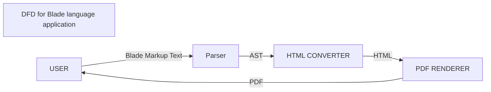

## Introduction

Blade is a markup language designed to create beautiful documents with minimal syntax.

### What is a markup language?

Markup language refers to a text-encoding system consisting of a set of symbols inserted in a text document to control its structure, formatting, or the relationship between its parts.

A markup language is a set of rules governing what markup information may be included in a document and how it is combined with the content of the document in a way to facilitate use by humans and computer programs. The idea and terminology evolved from the "marking up" of paper manuscripts (i.e., the revision instructions by editors), which is traditionally written with a red pen or blue pencil on authors' manuscripts.

Blade markup is human-readable written as a plain text document just like HTML and can be converted to a document.

Older markup languages, which typically focus on typography and presentation, include troff, TeX, and LaTeX. Scribe and most modern markup languages, such as XML, identify document components (for example headings, paragraphs, and tables), with the expectation that technology, such as stylesheets, will be used to apply formatting or other processing.

Some markup languages, such as the widely used HTML, have pre-defined presentation semantics, meaning that their specification prescribes some aspects of how to present the structured data on particular media. HTML, like DocBook, Open eBook, JATS, and many others is based on the markup meta-languages SGML and XML. That is, SGML and XML allow designers to specify particular schemas, which determine which elements, attributes, and other features are permitted, and where.

One extremely important characteristic of most markup languages is that they allow intermingling markup with document content such as text and pictures. For example, if a few words in a sentence need to be emphasized, or identified as a proper name, defined term, or another special item, the markup may be inserted between the characters of the sentence. This is quite different structurally from traditional databases, where it is by definition impossible to have data that is within a record but not within any field. Furthermore, markup for human-readable texts must maintain order: it would not suffice to make each paragraph of a book into a "paragraph" record, where those records do not maintain order. 

## Types of markup language

There are three main general categories of electronic markup, articulated in Coombs, Renear, and DeRose (1987), and Bray (2003).

### Presentational markup

The kind of markup used by traditional word-processing systems: binary codes embedded within document text that produce the WYSIWYG ("what you see is what you get") effect. Such markup is usually hidden from human users, even authors and editors. Properly speaking, such systems use procedural and/or descriptive markup underneath but convert it to "present" to the user as geometric arrangements of type.

### Procedural markup

Markup is embedded in a text which provides instructions for programs to process the text. Well-known examples include troff, TeX, and Markdown. It is assumed that software processes the text sequentially from beginning to end, following the instructions as encountered. Such text is often edited with the markup visible and directly manipulated by the author. Popular procedural markup systems usually include programming constructs, especially macros, allowing complex sets of instructions to be invoked by a simple name (and perhaps a few parameters). This is much faster, less error-prone, and more maintenance-friendly than re-stating the same or similar instructions in many places.

### Descriptive markup

Markup is specifically used to label parts of the document for what they are, rather than how they should be processed. Well-known systems that provide many such labels include LaTeX, HTML, and XML. The objective is to decouple the structure of the document from any particular treatment or rendition of it. Such markup is often described as "semantic". An example of a descriptive markup would be HTML's \<cite\> tag, which is used to label a citation. Descriptive markup — sometimes called logical markup or conceptual markup — encourages authors to write in a way that describes the material conceptually, rather than visually.

There is a considerable blurring of the lines between the types of markup. In modern word-processing systems, presentational markup is often saved in descriptive-markup-oriented systems such as XML, and then processed procedurally by implementations. The programming in procedural-markup systems, such as TeX, may be used to create higher-level markup systems that are more descriptive in nature, such as LaTeX.

In recent years, a number of markup languages have been developed with ease of use as a key goal, and without input from standards organizations, aimed at allowing authors to create formatted text via web browsers, for example in wikis and in web forums. These are sometimes called lightweight markup languages. Markdown, BBCode, and the markup language used by Wikipedia are examples of such languages.

Blade comes under the category of **lightweight markup language**.

### Existing systems

### GenCode

The first well-known public presentation of markup languages in computer text processing was made by William W. Tunnicliffe at a conference in 1967, although he preferred to call it generic coding. It can be seen as a response to the emergence of programs such as RUNOFF that each used their own control notations, often specific to the target typesetting device. In the 1970s, Tunnicliffe led the development of a standard called GenCode for the publishing industry and later was the first chairman of the International Organization for Standardization committee that created SGML, the first standard descriptive markup language. Book designer Stanley Rice published speculation along similar lines in 1970.

Brian Reid, in his 1980 dissertation at Carnegie Mellon University, developed the theory and a working implementation of descriptive markup in actual use. However, IBM researcher Charles Goldfarb is more commonly seen today as the "father" of markup languages. Goldfarb hit upon the basic idea while working on a primitive document management system intended for law firms in 1969, and helped invent IBM GML later that same year. GML was first publicly disclosed in 1973.

In 1975, Goldfarb moved from Cambridge, Massachusetts to Silicon Valley and became a product planner at the IBM Almaden Research Center. There, he convinced IBM's executives to deploy GML commercially in 1978 as part of IBM's Document Composition Facility product, and it was widely used in business within a few years.

SGML, which was based on both GML and GenCode, was an ISO project worked on by Goldfarb beginning in 1974. Goldfarb eventually became chair of the SGML committee. SGML was first released by ISO as the ISO 8879 standard in October 1986.
troff and nroff

Some early examples of computer markup languages available outside the publishing industry can be found in typesetting tools on Unix systems such as troff and nroff. In these systems, formatting commands were inserted into the document text so that typesetting software could format the text according to the editor's specifications. It was a trial and error iterative process to get a document printed correctly. Availability of WYSIWYG ("what you see is what you get") publishing software supplanted much use of these languages among casual users, though serious publishing work still uses markup to specify the non-visual structure of texts, and WYSIWYG editors now usually save documents in a markup-language-based format.

### TeX

Another major publishing standard is TeX, created and refined by Donald Knuth in the 1970s and '80s. TeX concentrated on the detailed layout of text and font descriptions to typeset mathematical books. This required Knuth to spend considerable time investigating the art of typesetting. TeX is mainly used in academia, where it is a de facto standard in many scientific disciplines. A TeX macro package known as LaTeX provides a descriptive markup system on top of TeX, and is widely used both among the scientific community and the publishing industry.

### Scribe, GML, and SGML
Main articles: Scribe (markup language), IBM Generalized Markup Language, and Standard Generalized Markup Language

The first language to make a clean distinction between structure and presentation was Scribe, developed by Brian Reid and described in his doctoral thesis in 1980. Scribe was revolutionary in a number of ways, not least that it introduced the idea of styles separated from the marked-up document, and of a grammar controlling the usage of descriptive elements. Did scribe influence the development of Generalized Markup Language (later SGML), and is a direct ancestor to HTML and LaTeX.

In the early 1980s, the idea that markup should focus on the structural aspects of a document and leave the visual presentation of that structure to the interpreter led to the creation of SGML. The language was developed by a committee chaired by Goldfarb. It incorporated ideas from many different sources, including Tunnicliffe's project, GenCode. Sharon Adler, Anders Berglund, and James A. Marke were also key members of the SGML committee.

SGML specified a syntax for including the markup in documents, as well as one for separately describing what tags were allowed, and where (the Document Type Definition (DTD), later known as a schema). This allowed authors to create and use any markup they wished, selecting tags that made the most sense to them and were named in their own natural languages, while also allowing automated verification. Thus, SGML is properly a meta-language, and many particular markup languages are derived from it. From the late '80s onward, most substantial new markup languages have been based on the SGML system, including for example TEI and DocBook. SGML was promulgated as an International Standard by International Organization for Standardization, ISO 8879, in 1986.

SGML found wide acceptance and use in fields with very large-scale documentation requirements. However, many found it cumbersome and difficult to learn — a side effect of its design attempting to do too much and being too flexible. For example, SGML made end tags (or start-tags, or even both) optional in certain contexts, because its developers thought markup would be done manually by overworked support staff who would appreciate saving keystrokes.

### HTML

In 1989, computer scientist Sir Tim Berners-Lee wrote a memo proposing an Internet-based hypertext system, then specified HTML and wrote the browser and server software in the last part of 1990. The first publicly available description of HTML was a document called "HTML Tags", first mentioned on the Internet by Berners-Lee in late 1991.It describes 18 elements comprising the initial, relatively simple design of HTML. Except for the hyperlink tag, these were strongly influenced by SGMLguid, an in-house SGML-based documentation format at CERN, and very similar to the sample schema in the SGML standard. Eleven of these elements still exist in HTML 4.

Berners-Lee considered HTML an SGML application. The Internet Engineering Task Force (IETF) formally defined it as such with the mid-1993 publication of the first proposal for an HTML specification: "Hypertext Markup Language (HTML)" Internet-Draft by Berners-Lee and Dan Connolly, which included an SGML Document Type Definition to define the grammar. Many of the HTML text elements are found in the 1988 ISO technical report TR 9537 Techniques for using SGML, which in turn covers the features of early text formatting languages such as that used by the RUNOFF command developed in the early 1960s for the CTSS (Compatible Time-Sharing System) operating system. These formatting commands were derived from those used by typesetters to manually format documents. Steven DeRose argues that HTML's use of descriptive markup (and the influence of SGML in particular) was a major factor in the success of the Web, because of the flexibility and extensibility that it enabled. HTML became the main markup language for creating web pages and other information that can be displayed in a web browser and is quite likely the most used markup language in the world today.
XML

XML (Extensible Markup Language) is a meta markup language that is very widely used. XML was developed by the World Wide Web Consortium, in a committee created and chaired by Jon Bosak. The main purpose of XML was to simplify SGML by focusing on a particular problem — documents on the Internet. XML remains a meta-language like SGML, allowing users to create any tags needed (hence "extensible") and then describe those tags and their permitted uses.

XML adoption was helped because every XML document can be written in such a way that it is also an SGML document, and existing SGML users and software could switch to XML fairly easily. However, XML eliminated many of the more complex features of SGML to simplify implementation environments such as documents and publications. It appeared to strike a happy medium between simplicity and flexibility, as well as supporting very robust schema definition and validation tools, and was rapidly adopted for many other uses. XML is now widely used for communicating data between applications, for serializing program data, for hardware communications protocols, vector graphics, and many other uses as well as documents.
XHTML

From January 2000 until HTML 5 was released, all W3C Recommendations for HTML have been based on XML, using the abbreviation XHTML (Extensible HyperText Markup Language). The language specification requires that XHTML Web documents be well-formed XML documents. This allows for more rigorous and robust documents, by avoiding many syntax errors which historically led to incompatible browser behaviors, while still using document components that are familiar with HTML.

One of the most noticeable differences between HTML and XHTML is the rule that all tags must be closed: empty HTML tags such as &lt;br> must either be closed with a regular end-tag, or replaced by a special form: &lt;br /> (the space before the '/' on the end tag is optional, but frequently used because it enables some pre-XML Web browsers, and SGML parsers, to accept the tag). Another difference is that all attribute values in tags must be quoted. Both these differences are commonly criticized as verbose but also praised because they make it far easier to detect, localize, and repair errors. Finally, all tag and attribute names within the XHTML namespace must be lowercase to be valid. HTML, on the other hand, was case-insensitive.
Other XML-based applications
Many XML-based applications now exist, including the Resource Description Framework as RDF/XML, XForms, DocBook, SOAP, and the Web Ontology Language (OWL). For a partial list of these, see List of XML markup languages.

## Analysis

### Existing system

There have been many lightweight markup languages.

#### Markdown

Markdown is a lightweight markup language for creating formatted text using a plain-text editor. John Gruber and Aaron Swartz created Markdown in 2004 as a markup language that is appealing to human readers in its source code form. Markdown is widely used in blogging, instant messaging, online forums, collaborative software, documentation pages, and readme files. 

#### BB code

BBCode ("Bulletin Board Code") is a lightweight markup language used to format messages in many Internet forum software. It was first introduced in 1998. The available "tags" of BBCode are usually indicated by square brackets ([ and ]) surrounding a keyword, and are parsed before being translated into HTML.

#### Org mode

Org Mode is a document editing, formatting, and organizing mode, designed for notes, planning, and authoring within the free software text editor Emacs. The name is used to encompass plain text files ("org files") that include simple marks to indicate levels of a hierarchy (such as the outline of an essay, a topic list with subtopics, nested computer code, etc.), and an editor with functions that can read the markup and manipulate hierarchy elements (expand/hide elements, move blocks of elements, check off to-do list items, etc.).

### Disadvantages of the existing system

- Most of the lightweight markup languages don't provide the facility to format documents; they provide facilities to format text.

### Proposed system

#### To create a markup language with  the following features

- A Simple syntax that could be picked up by anyone with minimal effort.
- The contents of the document should be readable when not rendered as a document -- in a plain text format.
- The language should provide the ability to format and create the document just with the help of tags.
- The language should support existing `HTML` tags.

## Design

### Modules

#### Parser
- Parses the markdown text to an Abstract syntax tree (AST).
- The parsing fails if there is any error in the input text.

#### HTML converter

- The AST generated by the parser is converted to HTML.
- The style tags of the Blade language are converted to the style tags of HTML.

#### PDF converter

- The rendered HTML document is broken down into pages of the desired size and converted to PDF.

### Data flow diagram

 
 

The user gives the markup text as input. The markup text is consumed by the parser. It checks for any syntactical errors. If there aren't any, it converts the markup to HTML along with the style information. This HTML is used to show the preview of the document to be generated. The user can edit the blade markup and see the live preview on the side.

The user can generate the document for the written markup code. This is done by the PDF generator module.

## Requirements

### Software

- Any modern web browser.

### Hardware

- Any computer system that can run a modern web browser.

## Implementation

### Parser

A parser is a software component that takes input data (frequently text) and builds a data structure – often some kind of parse tree, abstract syntax tree or other hierarchical structure, giving a structural representation of the input while checking for correct syntax. The parsing may be preceded or followed by other steps, or these may be combined into a single step. The parser is often preceded by a separate lexical analyser, which creates tokens from the sequence of input characters; alternatively, these can be combined in scannerless parsing. Parsers may be programmed by hand or may be automatically or semi-automatically generated by a parser generator. 

The term parsing is used to refer to the formal analysis by a computer of a sentence or other string of words into its constituents, resulting in a parse tree showing their syntactic relation to each other, which may also contain semantic and other information.

### AST

An abstract syntax tree (AST), or just syntax tree, is a tree representation of the abstract syntactic structure of text (often source code) written in a formal language. Each node of the tree denotes a construct occurring in the text. 

### Parser generator

It is a piece of software that generates the parser. The input of a parser generator is a grammar file, typically written in Backus–Naur form (BNF) or extended Backus–Naur form (EBNF) that defines the syntax of a target programming language.

The output is the source code of a parser for the programming language. The output of the (compiled) parser source code is a parser. It may be either standalone or embedded. This parser takes as an input the source code of the target programming language source and performs some action or outputs an abstract syntax tree (AST).

### Parsing Expression Grammar (PEG)

In computer science, parsing expression grammar (PEG) is a type of analytic formal grammar, i.e. it describes a formal language in terms of a set of rules for recognizing strings in the language. The formalism was introduced by Bryan Ford in 2004 and is closely related to the family of top-down parsing languages introduced in the early 1970s. Syntactically, PEGs also look similar to context-free grammars (CFGs), but they have a different interpretation: the choice operator selects the first match in PEG, while it is ambiguous in CFG. This is closer to how the string recognition tends to be done in practice, e.g. by a recursive descent parser.

### PDF Conversion

A JS library called *HTMLtocanvas* is used to generate pdf. It takes HTML components as input and provides pdf as output. The whole HTML output provided by *HTMLconverter* should be broken down into pages with approprite styling information and pdf files are generated.

### Softwares Used

#### Javascript

- The parser is generated using a library called *pegjs*. I takes PEG and provides the parser as output.
- *React* is used to create fornt end for browser which also includes Live Preview.
- HTML and CSS to create react components.

## Future enhancement

- Ability to embed images and crop them to required dimensions.
- Ability to create templates.
- More formatting features to the language.
- The ability for the user to create macros. Macros would be a group of tags.

